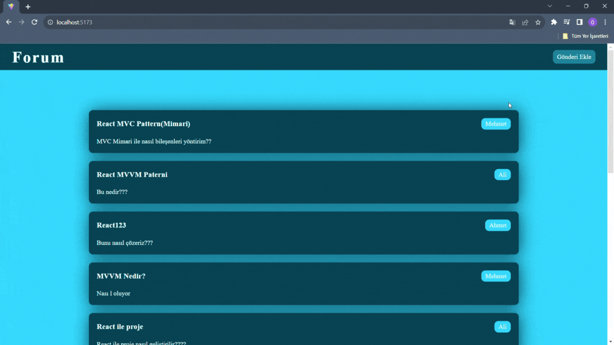

## MVC Forum

- This project aims to develop a web application using the MVC (Model-View-Controller) design pattern. This application provides a user interface where users can view and interact with data.

- Axios retrieves user data from JSON Server and displays this data using React components. Users can see the name and other information of each user.

- These posts are also received from JSON Server and contain details such as title and content. Users can see more information when they click on the posts.

- The project uses a Model (data model), a View (view), and a Controller (controller). The Model represents the data coming from the server. The View creates the user interface with React components. The Controller processes requests from the client and passes the data to the model.

## Libraries

- axios

- react-router-dom

- sass

- json-server

- toastify

## Gif

<!-- ## MVC (Model View Controller)

- Model: Uygulamanın veri mantığını veya yapısını temsil eder.
- - Örn: Projede tutulacak state'in yapısı burada tutulur.

- View: Son kullanıcın gördüğü tasarımdır.

- Controller: View ile model arasındaki bağlantıyı sağlar ayrıca
  viewin dinamizmini burdan gelir. -->
